# Entity Relationship Diagram

## Integrity Notes

- **Bucket → Project scoping** is enforced via SQL triggers (`trg_task_bucket_project_insert`, `trg_task_bucket_project_update`). A task's `bucket_id` must reference a bucket with the same `project_id`. This prevents cross-project bucket assignment at the schema level.
- **Bucket → Sprint scoping** (a sprint task's bucket must belong to the same sprint) is enforced in application code (route handlers). A composite FK isn't feasible here because `sprint_id` is nullable on both sides — project-level buckets intentionally have `sprint_id = NULL`.

```mermaid
erDiagram
    %% ═══════════════════════════════════════════
    %% CORE: Users & Auth
    %% ═══════════════════════════════════════════

    users {
        TEXT id PK
        TEXT username UK "UNIQUE NOT NULL"
        TEXT password_hash
        TEXT email
        TEXT display_name
        INT is_admin
        INT allow_query_param_auth
        TEXT timezone
        INT use_browser_time
        TEXT temperature_unit
        REAL weather_latitude
        REAL weather_longitude
        TEXT weather_location_name
        TEXT todo_hidden_project_types "JSON"
        TEXT obsidian_vault_name
        INT obsidian_enabled
        TEXT created_at
        TEXT updated_at
    }

    api_keys {
        TEXT id PK
        TEXT user_id FK
        TEXT key_hash
        TEXT name
        TEXT last_used_at
        TEXT expires_at
        TEXT created_at
    }

    oauth_clients {
        TEXT client_id PK
        TEXT client_secret
        TEXT redirect_uris
        TEXT client_name
        TEXT grant_types
        TEXT response_types
        TEXT token_endpoint_auth_method
        TEXT scope
        TEXT created_at
    }

    oauth_auth_codes {
        TEXT code PK
        TEXT client_id FK
        TEXT user_id FK
        TEXT redirect_uri
        TEXT code_challenge
        TEXT scopes
        INT expires_at
        TEXT created_at
    }

    oauth_tokens {
        TEXT token PK
        TEXT token_type "access | refresh"
        TEXT client_id FK
        TEXT user_id FK
        TEXT scopes
        INT expires_at
        TEXT created_at
    }

    %% ═══════════════════════════════════════════
    %% PROJECT MANAGEMENT
    %% ═══════════════════════════════════════════

    projects {
        TEXT id PK
        TEXT user_id FK
        TEXT title
        TEXT description
        TEXT parent_project_id FK "self-ref"
        TEXT hex_color
        INT is_favorite
        REAL position
        INT archived
        TEXT type "personal | dev | work | ..."
        TEXT project_mode "simple | sprint"
        TEXT default_columns "JSON"
        TEXT obsidian_path
        TEXT created_at
        TEXT updated_at
    }

    sprints {
        TEXT id PK
        TEXT project_id FK
        TEXT title
        TEXT description
        INT sprint_number
        TEXT status "planned | active | completed"
        TEXT start_date
        TEXT end_date
        INT archived
        TEXT obsidian_path
        TEXT created_at
        TEXT updated_at
    }

    buckets {
        TEXT id PK
        TEXT project_id FK
        TEXT sprint_id FK "nullable"
        TEXT title
        REAL position
        INT is_done_column
        TEXT emoji
        INT show_inline
        TEXT created_at
    }

    tasks {
        TEXT id PK
        TEXT user_id FK
        TEXT project_id FK "nullable"
        TEXT sprint_id FK "nullable"
        TEXT bucket_id FK "nullable"
        TEXT title
        TEXT description
        INT done
        TEXT done_at
        TEXT due_date
        TEXT start_date
        TEXT end_date
        INT priority "0-4"
        TEXT hex_color
        REAL percent_done "0-100"
        REAL position
        INT is_favorite
        INT repeat_after "seconds"
        INT repeat_mode
        TEXT assignee_user_id FK "nullable"
        TEXT assignee_name
        TEXT task_type "task | bug | feature | story"
        INT archived
        TEXT created_at
        TEXT updated_at
    }

    labels {
        TEXT id PK
        TEXT user_id FK
        TEXT title
        TEXT description
        TEXT hex_color
        TEXT created_at
        TEXT updated_at
    }

    task_labels {
        TEXT task_id FK, PK
        TEXT label_id FK, PK
    }

    task_comments {
        TEXT id PK
        TEXT task_id FK
        TEXT user_id FK
        TEXT content
        TEXT created_at
        TEXT updated_at
    }

    task_relations {
        TEXT id PK
        TEXT task_id FK
        TEXT related_task_id FK
        TEXT relation_kind "subtask | parent | blocking | ..."
        TEXT created_at
    }

    task_checklist_items {
        TEXT id PK
        TEXT task_id FK
        TEXT title
        INT done
        INT position
        TEXT created_at
    }

    task_links {
        TEXT task_id FK, PK
        TEXT target_type PK "goal | subgoal | habit | pomodoro"
        TEXT target_id PK
        TEXT created_at
    }

    %% ═══════════════════════════════════════════
    %% HARADA METHOD (Goals)
    %% ═══════════════════════════════════════════

    primary_goals {
        TEXT id PK
        TEXT user_id FK
        TEXT title
        TEXT description
        TEXT target_date
        TEXT status "active | completed | archived"
        TEXT theme_json "JSON"
        TEXT created_at
        TEXT updated_at
    }

    sub_goals {
        TEXT id PK
        TEXT primary_goal_id FK
        INT position "1-8"
        TEXT title
        TEXT description
        TEXT created_at
        TEXT updated_at
    }

    action_items {
        TEXT id PK
        TEXT sub_goal_id FK
        INT position "1-8"
        TEXT title
        TEXT description
        INT completed
        TEXT completed_at
        TEXT due_date
        TEXT created_at
        TEXT updated_at
    }

    activity_logs {
        TEXT id PK
        TEXT action_item_id FK
        TEXT log_type "note | progress | completion | media | link"
        TEXT content
        TEXT log_date
        INT duration_minutes
        REAL metric_value
        TEXT metric_unit
        TEXT media_url
        TEXT media_type
        TEXT external_link
        TEXT mood "motivated | challenged | ..."
        TEXT tags
        TEXT created_at
        TEXT updated_at
    }

    shared_goals {
        TEXT id PK
        TEXT goal_id FK
        TEXT user_id FK
        TEXT token UK
        INT show_logs
        INT show_guestbook
        INT is_active
        TEXT created_at
    }

    guestbook {
        TEXT id PK
        TEXT user_id FK
        TEXT agent_name
        TEXT comment
        TEXT target_type "user | goal | subgoal | action"
        TEXT target_id
        TEXT created_at
    }

    %% ═══════════════════════════════════════════
    %% HABITS & POMODORO
    %% ═══════════════════════════════════════════

    habits {
        TEXT id PK
        TEXT user_id FK
        TEXT title
        TEXT emoji
        TEXT type "habit | quit"
        TEXT frequency "daily | weekly"
        TEXT quit_date
        TEXT subgoal_id FK "nullable"
        INT archived
        INT position
        TEXT created_at
        TEXT updated_at
    }

    habit_logs {
        TEXT id PK
        TEXT habit_id FK
        TEXT log_date
        TEXT note
        TEXT created_at
    }

    pomodoro_sessions {
        TEXT id PK
        TEXT user_id FK
        TEXT started_at
        TEXT ended_at
        INT duration_minutes
        TEXT status "completed | cancelled | in_progress"
        TEXT note
        TEXT created_at
    }

    pomodoro_links {
        TEXT pomodoro_id FK, PK
        TEXT target_type PK "task | project | sprint | ..."
        TEXT target_id PK
        TEXT created_at
    }

    %% ═══════════════════════════════════════════
    %% CALENDAR & EMAIL
    %% ═══════════════════════════════════════════

    events {
        TEXT id PK
        TEXT user_id FK
        TEXT title
        TEXT description
        TEXT start_date
        TEXT end_date
        INT all_day
        TEXT color
        TEXT location
        TEXT created_at
        TEXT updated_at
    }

    google_calendar_tokens {
        TEXT id PK
        TEXT user_id FK, UK
        TEXT access_token_encrypted
        TEXT refresh_token_encrypted
        TEXT token_expiry
        TEXT google_email
        TEXT selected_calendars "JSON"
        INT sync_enabled
        TEXT granted_scopes "JSON"
        INT gmail_sync_enabled
        TEXT last_synced_at
        TEXT created_at
        TEXT updated_at
    }

    google_calendar_events {
        TEXT id PK
        TEXT user_id FK
        TEXT google_event_id
        TEXT calendar_id
        TEXT title
        TEXT start_date
        TEXT end_date
        INT all_day
        TEXT location
        TEXT color
        TEXT html_link
        TEXT status
        TEXT origin "google"
        TEXT created_at
        TEXT updated_at
    }

    gmail_messages {
        TEXT id PK
        TEXT user_id FK
        TEXT gmail_message_id
        TEXT thread_id
        TEXT from_address
        TEXT from_name
        TEXT to_address
        TEXT subject
        TEXT snippet
        TEXT body_html
        TEXT body_text
        TEXT date
        TEXT label_ids "JSON"
        INT is_unread
        INT has_attachments
        TEXT created_at
    }

    %% ═══════════════════════════════════════════
    %% CONTACTS & NOTES & CHAT
    %% ═══════════════════════════════════════════

    contacts {
        TEXT id PK
        TEXT user_id FK
        TEXT name
        TEXT nickname
        TEXT company
        TEXT job_title
        TEXT email
        TEXT phone
        TEXT website
        TEXT location
        TEXT birthday
        TEXT how_met
        TEXT notes
        TEXT relationship_type
        INT contact_frequency_days
        TEXT last_contacted_at
        INT is_favorite
        INT archived
        TEXT created_at
        TEXT updated_at
    }

    contact_interactions {
        TEXT id PK
        TEXT contact_id FK
        TEXT user_id FK
        TEXT type
        TEXT title
        TEXT description
        TEXT interaction_date
        TEXT created_at
    }

    contact_tags {
        TEXT contact_id FK, PK
        TEXT tag PK
    }

    contact_field_values {
        TEXT id PK
        TEXT contact_id FK
        TEXT field_group
        TEXT field_label
        TEXT field_value
        INT position
    }

    quick_notes {
        TEXT id PK
        TEXT user_id FK
        TEXT content
        TEXT created_at
        TEXT updated_at
    }

    chat_conversations {
        TEXT id PK
        TEXT user_id FK
        TEXT title
        TEXT created_at
        TEXT updated_at
    }

    chat_messages {
        TEXT id PK
        TEXT conversation_id FK
        TEXT role "user | assistant"
        TEXT content
        TEXT created_at
    }

    chat_memory {
        TEXT id PK
        TEXT user_id FK
        TEXT content
        TEXT category
        TEXT created_at
    }

    agent_etiquette {
        TEXT id PK
        TEXT user_id FK
        TEXT content
        INT position
        INT is_default
        TEXT created_at
    }

    %% ═══════════════════════════════════════════
    %% RELATIONSHIPS
    %% ═══════════════════════════════════════════

    %% Auth
    users ||--o{ api_keys : "has"
    users ||--o{ oauth_auth_codes : "authorizes"
    users ||--o{ oauth_tokens : "holds"
    oauth_clients ||--o{ oauth_auth_codes : "issues"
    oauth_clients ||--o{ oauth_tokens : "issues"

    %% Project Management
    users ||--o{ projects : "owns"
    projects ||--o{ projects : "parent"
    projects ||--o{ sprints : "contains"
    projects ||--o{ buckets : "has project-level"
    sprints ||--o{ buckets : "has sprint-level"
    users ||--o{ tasks : "owns"
    projects ||--o{ tasks : "contains"
    sprints ||--o{ tasks : "scoped to"
    buckets ||--o{ tasks : "staged in"
    users ||--o{ labels : "defines"
    tasks ||--o{ task_labels : "tagged with"
    labels ||--o{ task_labels : "applied to"
    tasks ||--o{ task_comments : "has"
    users ||--o{ task_comments : "authored"
    tasks ||--o{ task_relations : "relates from"
    tasks ||--o{ task_relations : "relates to"
    tasks ||--o{ task_checklist_items : "has"
    tasks ||--o{ task_links : "links to"

    %% Harada Goals
    users ||--o{ primary_goals : "sets"
    primary_goals ||--o{ sub_goals : "broken into"
    sub_goals ||--o{ action_items : "achieved by"
    action_items ||--o{ activity_logs : "tracked via"
    primary_goals ||--o{ shared_goals : "shared as"
    users ||--o{ shared_goals : "shares"
    users ||--o{ guestbook : "receives"

    %% Habits & Pomodoro
    users ||--o{ habits : "tracks"
    habits ||--o{ habit_logs : "logged"
    habits }o--o| sub_goals : "linked to"
    users ||--o{ pomodoro_sessions : "runs"
    pomodoro_sessions ||--o{ pomodoro_links : "links to"

    %% Calendar & Email
    users ||--o{ events : "schedules"
    users ||--o| google_calendar_tokens : "authenticates"
    users ||--o{ google_calendar_events : "syncs"
    users ||--o{ gmail_messages : "syncs"

    %% Contacts
    users ||--o{ contacts : "manages"
    contacts ||--o{ contact_interactions : "has"
    users ||--o{ contact_interactions : "records"
    contacts ||--o{ contact_tags : "tagged"
    contacts ||--o{ contact_field_values : "custom fields"

    %% Notes & Chat
    users ||--o{ quick_notes : "writes"
    users ||--o{ chat_conversations : "starts"
    chat_conversations ||--o{ chat_messages : "contains"
    users ||--o{ chat_memory : "remembers"
    users ||--o{ agent_etiquette : "configures"
```

